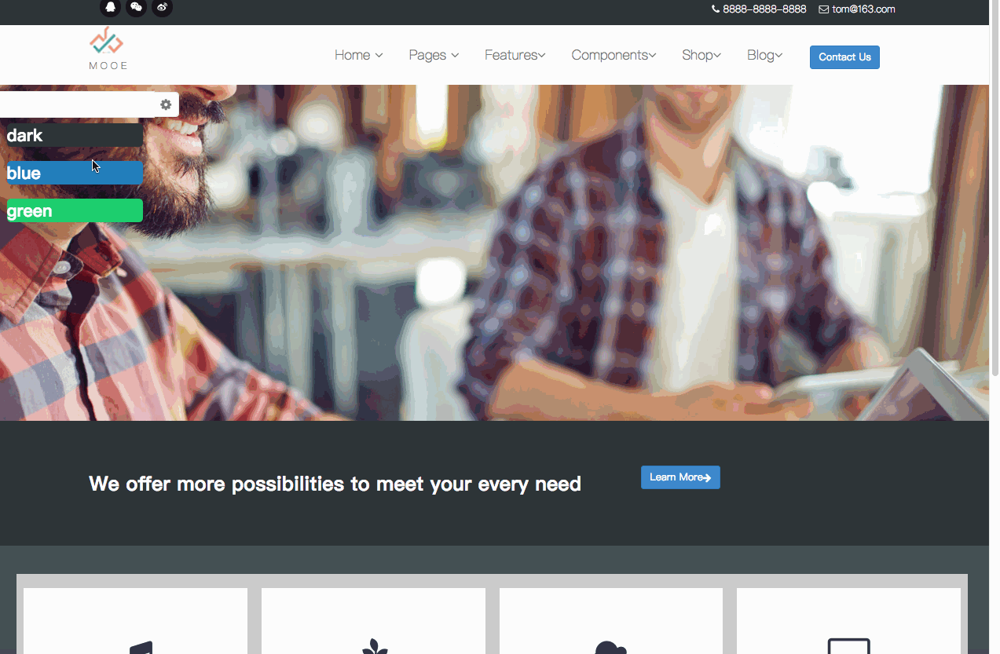

## 一个纯scss编写的[响应式多主题网页demo](https://github.com/chencaijun1992/SassStydy/blob/master/template_index.html)
* 该demo是一个响应式的网站，自适应从320px-1200px各种屏幕（自响应式布局）
* 当中的button和grid系统是单独取出bootstrp的源码编译而成（减少代码臃肿）
* 加入多主题，可以切换多种网站主题（模块化css代码，适应弹性需求）

## 项目演示

## 扩展阅读
[Bootstrap栅格系统和Button源码剖析](./BootstrapCodeAnalysis.md)

